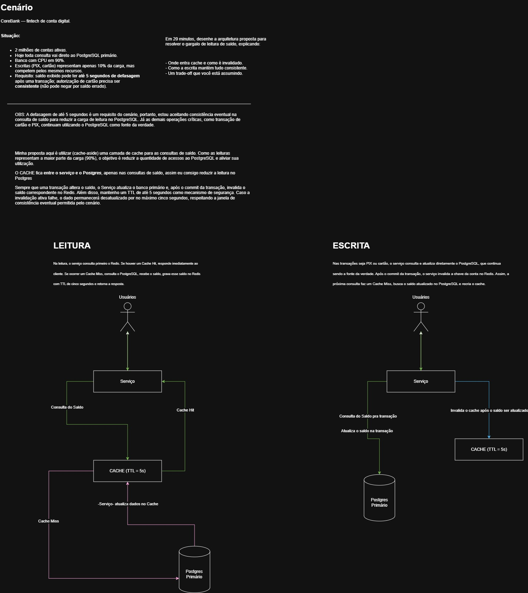

# CoreBank API

A Spring Boot project that demonstrates a scalable Core Banking solution for customer balance queries and financial transactions using PostgreSQL, Redis Cache and the Cache-Aside Pattern.

## Overview

This project was created to simulate a real-world architecture challenge commonly found in fintechs and digital banks.

The main goal is to reduce database load by introducing a distributed cache while maintaining transactional consistency for balance updates.

## Features

- Balance Query API
- Card Transactions
- PIX Transactions
- Redis Cache
- Cache-Aside Pattern
- Cache Hit / Cache Miss
- Cache Invalidation
- TTL Strategy
- Transactional Consistency
- PostgreSQL as Source of Truth

## Tech Stack

- Java 25
- Spring Boot
- Spring Data JPA
- PostgreSQL
- Redis
- Maven
- Docker Compose

---

# Architecture

The proposed solution for the challenge is shown below.

> *Solution image*



---

# Cache Strategy

The application uses the Cache-Aside Pattern.

### Read Flow

1. Client requests account balance.
2. Application checks Redis.
3. Cache Hit → Return immediately.
4. Cache Miss → Query PostgreSQL.
5. Store balance in Redis (TTL = 5 seconds).
6. Return response.

### Write Flow

1. Update balance in PostgreSQL.
2. Commit transaction.
3. Invalidate Redis cache.
4. Next read reloads the cache.

---

# Project Structure

The project follows Clean Architecture principles, keeping business rules independent from frameworks and external technologies.

```text
src/main/java/com/corebank/apispringbootcorebank
│
├── domain
│
├── application
│
├── infrastructure
│
└── presentation
```

---

# Roadmap

- [x] Spring Boot Project
- [x] PostgreSQL Integration
- [x] Redis Integration
- [x] Balance Endpoint
- [x] Cache-Aside Implementation
- [x] Cache Invalidation
- [x] Card Transactions
- [x] PIX Transactions
- [x] Unit Tests
- [x] Integration Tests
- [x] Docker Compose
---

# Author
Developed by **Edson Fernandes**
