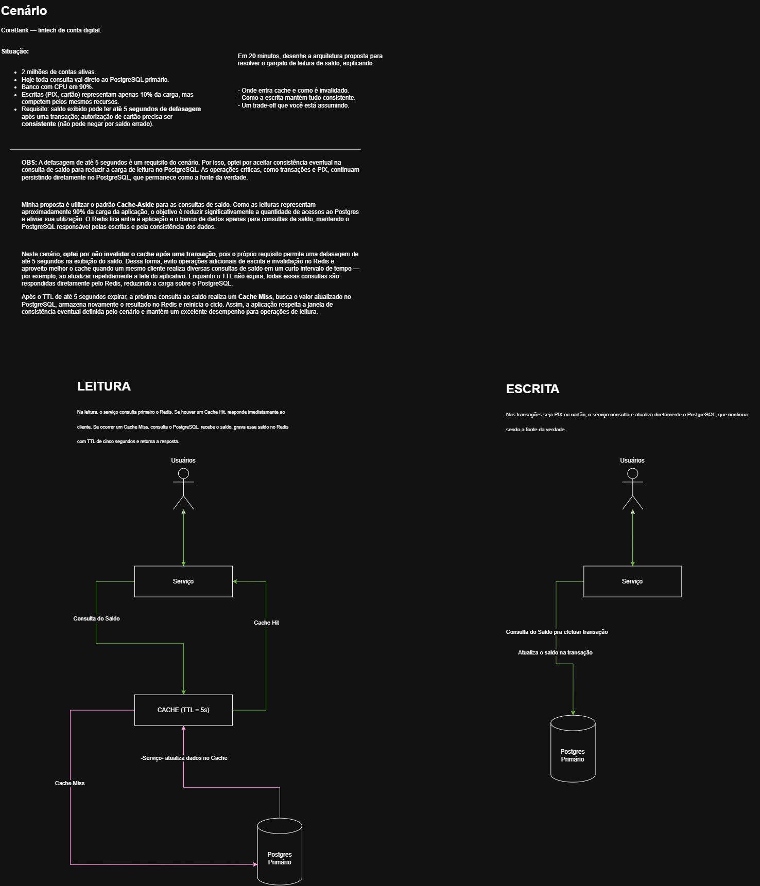

# CoreBank API

A Spring Boot project that demonstrates a scalable Core Banking solution for customer balance queries and financial transactions using PostgreSQL, Redis Cache and the Cache-Aside Pattern.

## Overview

This project was created to simulate a real-world architecture challenge commonly found in fintechs and digital banks.

The main goal is to reduce database load by introducing a distributed cache while respecting a business requirement that allows account balances to be up to **5 seconds stale**.

PostgreSQL remains the **Source of Truth** for all transactional operations, while Redis is used exclusively to optimize balance queries.

## Features

- Account Creation API
- Balance Query API
- Card Transactions
- PIX Transactions
- Redis Cache
- Cache-Aside Pattern
- Cache Hit / Cache Miss
- TTL Strategy (5 seconds)
- Eventual Consistency
- PostgreSQL as Source of Truth

## Tech Stack

- Java 25
- Spring Boot
- Spring Data JPA
- PostgreSQL
- Redis
- Maven
- Docker Compose

---

# Architecture

The proposed solution for the challenge is shown below.

> *Solution image*



---

# Cache Strategy

The application uses the **Cache-Aside Pattern** for account balance queries.

### Read Flow

1. Client requests the account balance.
2. Application checks Redis.
3. Cache Hit → Return cached balance immediately.
4. Cache Miss → Query PostgreSQL.
5. Store balance in Redis (TTL = 5 seconds).
6. Return response.

### Write Flow

1. Financial transaction updates PostgreSQL.
2. PostgreSQL remains the Source of Truth.
3. Redis cache is **not invalidated**.
4. Cached balance expires automatically after 5 seconds.
5. The next balance request reloads the latest value from PostgreSQL.

> **Design Decision**
>
> The challenge explicitly allows account balances to remain stale for up to **5 seconds**. Because of this requirement, the application accepts **eventual consistency** and intentionally does not invalidate the Redis cache after balance updates.
>
> This approach reduces unnecessary Redis write operations and improves performance when the same customer performs multiple balance queries within a short period of time (for example, refreshing the mobile application's balance screen).

---

# Running the Project

## Prerequisites

- Java 25
- Maven
- Docker
- Docker Compose

---

## Clone the repository

```bash
git clone https://github.com/<your-user>/api-springboot-corebank.git

cd api-springboot-corebank
```

---

## Start PostgreSQL and Redis

```bash
docker compose up -d
```

Verify that both containers are running:

```bash
docker ps
```

Expected containers:

- PostgreSQL
- Redis

---

## Run the application

```bash
mvn spring-boot:run
```

The API will be available at:

```
http://localhost:8080
```

---

# Testing the Cache-Aside Pattern

## 1. Create an account

```
POST /api/v1/accounts
```

Example response:

```json
{
  "accountId": "74c8c112-d1cd-4bad-b60c-a1c48f244d33",
  "balance": 0.00
}
```

Save the generated **accountId**.

---

## 2. First balance request

```
GET /api/v1/accounts/{accountId}/balance
```

Expected behavior:

- Cache Miss
- PostgreSQL query executed
- Balance stored in Redis

Application log:

```
Account balance cache miss

SELECT ...

Account balance saved in Redis
```

---

## 3. Second balance request

Execute the same request before the TTL expires.

Expected behavior:

- Cache Hit
- No SQL query executed

Application log:

```
Account balance cache hit
```

---

## 4. Verify Redis

Open Redis CLI:

```bash
docker exec -it corebank-redis redis-cli
```

Retrieve the cached balance:

```text
GET corebank:account:balance:{accountId}
```

Expected:

```text
0.00
```

Verify remaining TTL:

```text
TTL corebank:account:balance:{accountId}
```

Expected:

```text
5
```

(or any remaining value)

---

## 5. Wait for cache expiration

Wait more than **5 seconds**.

Verify again:

```text
TTL corebank:account:balance:{accountId}
```

Expected:

```text
-2
```

The cache entry no longer exists.

---

## 6. Query the balance again

```
GET /api/v1/accounts/{accountId}/balance
```

Expected behavior:

- Cache Miss
- PostgreSQL queried again
- Redis cache rebuilt automatically

---

# Project Structure

The project follows Clean Architecture principles, keeping business rules independent from frameworks and external technologies.

```text
src/main/java/com/corebank/apispringbootcorebank
│
├── domain
│
├── application
│
├── infrastructure
│
└── presentation
```

---

# Roadmap

- [x] Spring Boot Project
- [x] PostgreSQL Integration
- [x] Redis Integration
- [x] Balance Endpoint
- [x] Cache-Aside Implementation
- [x] TTL Strategy
- [x] Card Transactions
- [x] PIX Transactions
- [x] Unit Tests
- [x] Integration Tests
- [x] Docker Compose

---

# Author

Developed by **Edson Fernandes**
